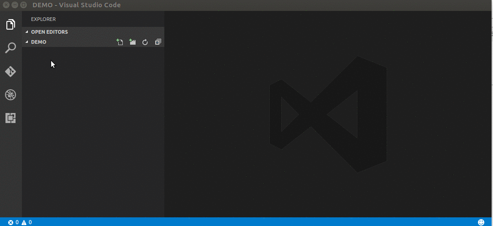
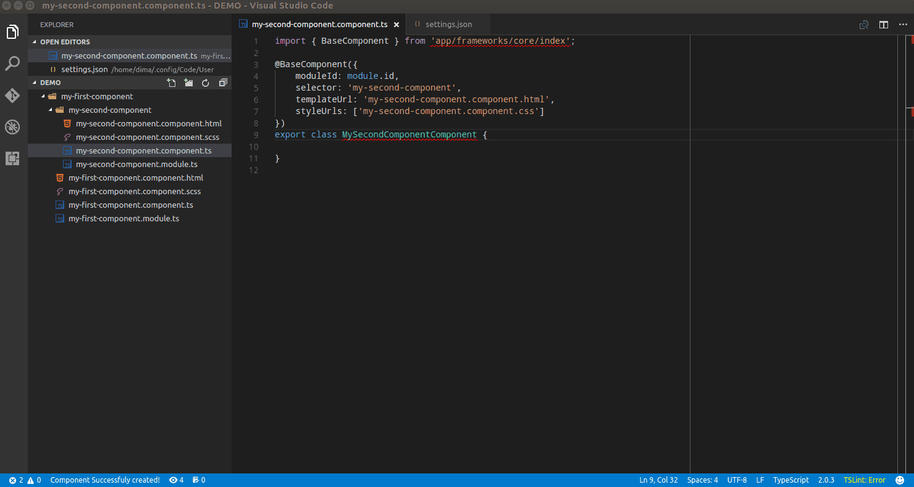

# Angular2 Component Generation Extension for VS CODE
[](https://marketplace.visualstudio.com/items?itemName=dbaikov.vscode-angular2-component-generator)
[](https://marketplace.visualstudio.com/items?itemName=dbaikov.vscode-angular2-component-generator)
(**vscode-angular2-component-generator**)

## Description
Extension automatically creates folder for angular2 component containing :
- `component.ts`
- `module.ts`
- `component.html`
- `component.css`

## Usage

- Right click on on the file or folder in the explorer
- Select "New Angular2 Component"
- Enter component name in the pop up in camelCase



## Configuration
- global:
    - quotes - `single` or `double` in other words ( `'`  or  `"` )
    - generateFolder - `true` or `false` generate or not separate folder for newly created component
- create true / false - (controls weather to generate this file or not)
- extension - extension of generated file (e.g. you might want to change "scss" to just plain "css")
- template - path to the custom template for the generated file
    - {selector}    -> replaced with `lower case, dash separated string`
    - {templateUrl} -> replaced with `${selector}.component.html`
    - {styleUrls}   -> replaced with `${selector}.component.css`
    - {className}   -> replaced with `componentName in PascalCase`

Use the "template" key to override default templates for the extension

```json
{
    "global": {
        "quotes": "single", // or "double",
        "generateFolder": true, // or false
    },
    "files": {
        "component": {
            "create": true,
            "extension": "ts",
            "template": "${workspaceRoot}/myComponent.template"
        },
        "css": {
            "create": true,
            "extension": "scss"
        },
        "html": {
            "create": true,
            "extension": "html"
        },
        "module": {
            "create": true,
            "extension": "ts"
        }
    }
}
```


## FAQ
- [How can I generate a component in the flat configuration (in same folder as parent)?](#how-can-i-generate-a-component-in-the-flat-configuration-(in-same-folder-as-parent)?)

### How can I generate a component in the flat configuration (in same folder as parent)?
In the global configuration part set the `generateFolder` key to `false`.


## Bugs

Please report [here](https://github.com/dbaikov/vscode-angular2-component-generator/issues)
